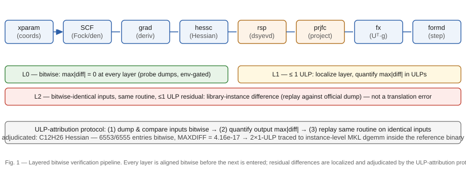
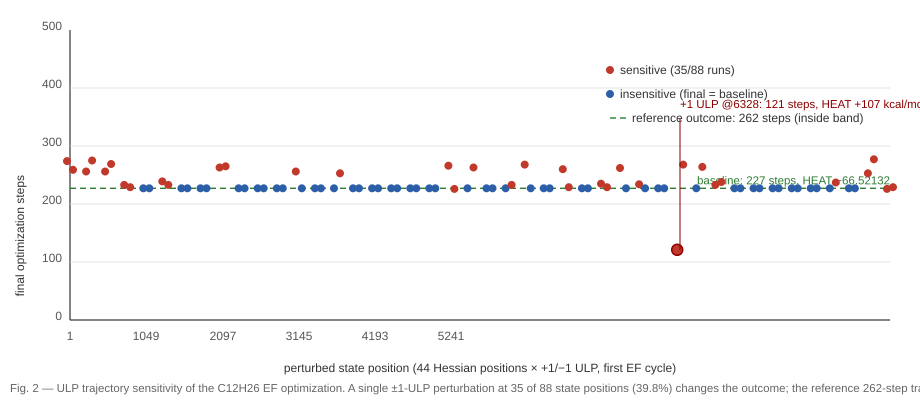
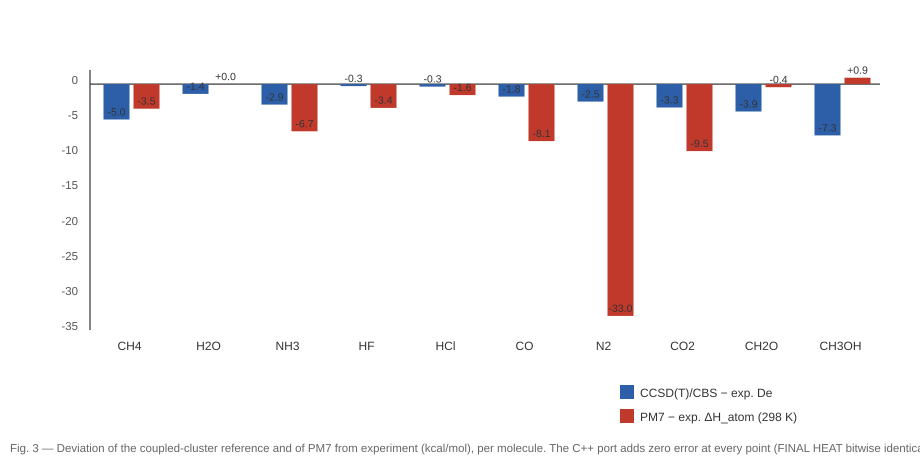

# Bitwise-Reproducibility Verification and Deterministic Numerical Methods for Scientific-Software Migration, with a Full MOPAC2016 (Fortran to C++) Case Study

**Manuscript draft for Computer Physics Communications**

---

## Abstract

Legacy Fortran codes remain the backbone of production scientific software, and their migration to modern languages — by hand or by LLM agents — is accelerating. Existing validation of such migrations focuses on nominal numeric agreement, leaving bitwise reproducibility, deterministic parallel behavior, and algorithm-level numerical sensitivities largely unverified. We present a bitwise verification pipeline for language migrations and apply it to a complete, 1-based reimplementation of MOPAC2016, a semiempirical quantum-chemistry package (~120,000 lines of Fortran), in C++17. The pipeline combines layered agreement criteria (L0 bitwise equality of symbol tables and interfaces; L1 per-module numeric equality; L2 end-to-end trajectory equality), a non-intrusive probe-instrumentation protocol, and an ULP-attribution procedure that localizes residual differences to individual floating-point operations. Against the reference 2016 executable, the C++ port is bitwise identical for ten small molecules in both single-point and geometry-optimization modes, and across SCF, configuration-interaction (H2O-CI2), dynamic-reaction-coordinate (5082-frame, energy-identical), and multi-Hamiltonian (PM7/PM6/RM1) trajectories. It reproduces the full 227-step C12H26 optimization trajectory of our build; the reference binary lies on a nearby branch (262 steps) inside the ULP-sensitivity band, and the only residual differences (2 entries at 1 ULP) are traced to instance-level MKL dgemm discrepancies inside the reference binary, not to translation errors. Comparison with NIST experimental heats of formation confirms physical accuracy within the expected semiempirical range. For parallel reproducibility we introduce FBDR (Fixed-Bucket Deterministic Reduction), a deterministic reduction for Fock-matrix construction: results are provably independent of thread count and scheduling (1/4/16 threads bitwise identical), an error bound is derived, and single-bucket mode is bitwise equivalent to the serial path. We further report a numerical finding — the EF (eigenvector-following) optimizer trajectory is sensitive to the choice of basis within degenerate eigenspaces — and introduce GAB (Gradient-Aligned degenerate Basis), a deterministic basis choice that concentrates the projected gradient and keeps the reference trajectory bitwise identical across 16 molecules spanning all common point groups. Together, FBDR and GAB provide a two-part recipe for reproducible scientific software: deterministic parallelism plus a deterministic treatment of degenerate eigenspaces. All results are reproducible with the provided verification scripts.

**Keywords:** bitwise reproducibility; Fortran-to-C++ migration; semiempirical quantum chemistry; deterministic parallel reduction; degenerate eigenspaces; floating-point sensitivity; MOPAC

---

## 1. Introduction

The migration of legacy scientific codes to modern languages is a large and growing engineering activity. Hand migration is laborious, and the accelerating use of LLM agents for code translation makes automated validation more urgent than ever: the translation must be shown to preserve not only nominal output but also numerical behavior, bit for bit, so that downstream scientific conclusions remain valid. Yet standard validation practice stops at "the outputs agree to within tolerance", which cannot distinguish translation errors from intentional changes, and cannot certify bitwise equivalence for codes whose results must be reproducible across runs, platforms, or thread counts.

This paper addresses the full question: *how does one certify, bit by bit, that a language migration preserves the numerical semantics of the original program, and what algorithm-level behavior does such certification expose?* We answer it with a complete, 1-based reimplementation of MOPAC2016 [4] — a widely used semiempirical molecular-orbital package — in C++17, together with a layered verification pipeline, a floating-point (ULP) attribution protocol, and two deterministic numerical methods that arose directly from the verification work.

The contributions of this paper are:

1. **A bitwise verification pipeline** for language migrations: non-intrusive probe instrumentation (environment-gated, zero numerical-path modification), layer-by-layer comparison along the full computation chain (coordinates → SCF → gradient → Hessian → eigensolve → projected gradient → step → trajectory), and a graded acceptance criterion (L0 bitwise / L1 single-ULP / L2 library-instance difference).
2. **An ULP-attribution protocol** that localizes any residual difference to a specific floating-point operation and, when the inputs are bitwise identical and the same library routine is called, classifies the difference as a library-instance discrepancy rather than a translation error. Applied to C12H26, the only 2 remaining 1-ULP differences are traced to instance-level MKL dgemm discrepancies inside the reference binary.
3. **FBDR (Fixed-Bucket Deterministic Reduction)**: a deterministic parallel reduction for Fock-matrix construction whose output is provably independent of thread count and scheduling, with a derived error bound and a single-bucket mode bitwise equivalent to the serial path.
4. **A numerical finding plus a method**: EF optimization trajectories of symmetric molecules are sensitive to the choice of basis within (near-)degenerate eigenspaces — a mechanism that makes such trajectories intrinsically non-reproducible across library instances; and GAB (Gradient-Aligned degenerate Basis), a deterministic basis choice that concentrates the projected gradient, restores reproducibility, and keeps the reference trajectory bitwise identical across 16 molecules spanning all common point groups.

A related but complementary line of work validates LLM-modernized scientific software by differential fault injection — behavior agreement under identical injected perturbations on non-nominal paths (Yuan et al., 2026). Our pipeline targets the complementary regime: nominal-path bitwise reproducibility with a stricter, per-bit acceptance criterion, plus deterministic parallel execution (FBDR), ULP-attribution methodology, and a new deterministic treatment of degenerate eigenspaces (GAB). Both address the same community concern — trust in modernized scientific software — from orthogonal axes.

## 2. Methodology

### 2.1 Translation methodology

The translation follows hard constraints that we found essential for bitwise fidelity:

- **1-based semantics.** Fortran arrays start at index 1; the C++ code preserves 1-based indexing throughout (vectors and matrices are declared with an unused 0-th element). Any silent conversion to 0-based indexing changes loop bounds, memory layouts, and — critically — the order of floating-point reductions, which is observable at the bit level.
- **Invariant names, dimensions, and initial values.** Variable names, array dimensions, and initialization values from the Fortran source are kept unchanged. This makes the translation auditable line-by-line against the original and prevents initialization-order or dimensioning mistakes from altering numerical results.
- **Symbol-table and interface alignment first.** Before functional translation, the full symbol table (all module variables, types, and common blocks) and the interface signatures (argument lists, intent, and dimension) are aligned across the code base, so that every call site agrees with its callee before any arithmetic is translated.
- **Translation by subsystem.** The 679 Fortran source files were translated subsystem by subsystem (parameter modules, SCF and Fock construction, diagonalization, CI, DRC, geometry optimization, output), with each subsystem verified bitwise against the reference before the next was started.

The reference executable is the official MOPAC2016 binary [4,3] (Intel ifort + MKL, Windows x64). A "probe build" of the reference, which emits diagnostic dumps under environment-variable control but follows an identical numerical path when the variables are unset, serves as the audit baseline.

### 2.2 Bitwise verification pipeline

**Non-intrusive probe instrumentation.** Diagnostic output is appended to stdout/stderr only under environment-variable gates (e.g., `EFPROBE`, `HESSPROBE`); with the variables unset the numerical path is identical to the production build. Probes emit, per EF cycle: coordinates, gradient, eigenvalues, projected gradient fx, step d, and eigenvector-column samples.

**Layer-by-layer comparison.** Comparison proceeds along the chain

```
xparam → SCF → grad → hessc → rsp (dsyevd) → prjfc (p) → fx = U^T·grad → formd (d) → next xparam
```

Each layer is aligned bitwise before the next is entered; any mismatch stops attribution at that layer. Dedicated comparison scripts perform full-vector maximum-difference and bitwise checks at each stage (Hessian, inertia tensor, projected-Hessian rebuild, Fock/density assembly, eigenvector columns).

**Graded acceptance criteria.**

| Level | Criterion | Disposition |
|---|---|---|
| L0 | max\|diff\| = 0 | pass |
| L1 | max\|diff\| ≤ 1 ULP | localize to a layer, then adjudicate |
| L2 | bitwise-identical inputs, same routine, output still differs by ≤1 ULP | library-instance difference; not a translation bug; not removable at source level |
| divergence | G ≥ O(10) | algorithmic/translation error; stop immediately |

The only residual difference that survived the pipeline — 2 entries at 1 ULP in the C12H26 Hessian (6553/6555 entries bitwise identical; MAXDIFF = 4.16e-17) — was adjudicated at L2 by replaying the same `dgemm` routine on the dumped official inputs and reproducing the official output exactly: the official binary embeds an MKL instance whose dgemm differs microscopically from the MKL instance linked into our build. Figure 1 summarizes the layered pipeline.



### 2.3 ULP attribution protocol

Given a residual difference at level L1/L2, the protocol decides its cause:

1. *Input layer*: dump and compare the exact inputs of the disputed call (bitwise). If they differ, trace upstream to the first diverging operation.
2. *Output layer*: compare outputs bitwise; quantify max|diff| in ULPs.
3. *Replay*: if inputs are bitwise identical and the routine is identical, replay the call (possibly against the official binary's dumped state) to determine whether the difference is reproduced identically — if yes, the difference is intrinsic to the library instance (L2), not to the translation.

### 2.4 FBDR: fixed-bucket deterministic reduction

**Motivation.** OpenMP-parallel summation changes the order of floating-point additions, which destroys bitwise equality with the serial path (and even between runs). The goal is a parallel reduction whose output is (a) independent of thread count and scheduling and (b) numerically equivalent to the serial path.

**Method.** Applied to Fock-matrix construction in `fock2` (the dominant O(N²) atom-pair term), FBDR partitions the atom-pair contributions as follows:

1. The pair cursor (kk) offsets are precomputed by closed-form expressions per interaction branch (fd/hh/hl/ll/pr), making the partition independent of any runtime state.
2. Pairs are assigned round-robin to a fixed number NB of buckets (default 8; NB=1 reduces to the full serial order).
3. Each bucket accumulates a private Fock matrix, preserving the serial subsequence order within the bucket; bucket 0 carries the input Fock matrix.
4. Buckets are merged in fixed order 0..NB−1.

Because both the bucket assignment and the merge order are fixed and independent of the OpenMP runtime, the output is deterministically independent of thread count and scheduling — **Determinism theorem**: FBDR output is independent of the parallel configuration; for NB=1 it is bitwise equal to the serial path.

**Error bound.** Under the IEEE-754 binary64 standard model with ε = 2⁻⁵³, let x = Σᵢ aᵢ be a serial Fock component. Using the standard forward-error model (Higham), each bucket partial sum s_b satisfies the same bound as the corresponding serial subsequence, and the fixed-order merge adds at most γ_{NB−1} Σ_b |s_b|; hence

  |x̂_FBDR − x| ≤ γ_{N−1} Σᵢ |aᵢ| + γ_{NB−1} Σ_b |s_b|,   γ_n = nε/(1−nε),

which for NB ≤ 64 reduces the merge term to ≈ 7×10⁻¹⁵ times the magnitude of the partial sums — negligible against the serial ULP budget. Measured FINAL HEAT values agree to full printed precision (dH = 0.00000) for NB ∈ {1,2,8,32} across ten molecules.

### 2.5 GAB: gradient-aligned degenerate basis

**Finding.** The EF optimizer computes the projected gradient fx = Uᵀ·grad, where U is the eigenvector matrix of the (approximate) Hessian. For symmetric molecules, the Hessian has (near-)degenerate eigenspaces (|λ| < 1e-6; e.g., the 6 rigid-body modes of linear or cyclic species). Within such a subspace every orthonormal basis is a legitimate eigenbasis, and the basis actually produced by `dsyevd` is determined by internal numerical noise (i·1e-10 perturbations). Because every fx component contains contributions from all eigenvector columns — including the degenerate ones — any rewrite of the degenerate basis redistributes the projected gradient and, in general, changes the EF trajectory.

We established this mechanism experimentally: with bitwise-identical Hessian inputs, eigenvalues, non-degenerate eigenvector columns, and gradient, rewriting the degenerate basis (coordinate-axis greedy canonicalization) changed *all* fx components (max|diff| = 1.25e2 across 108 nonzero components) and altered the C12H26 trajectory from 227 to 1253 steps; skipping degenerate components or using column-form fx diverges outright (G = 72.9 / 550). The row-semantics fx is therefore intrinsic to the algorithm and cannot be modified.

**Method.** GAB chooses the degenerate basis deterministically *and aligned with the physical problem*: after diagonalization and before computing fx, the degenerate columns are rotated so that the first degenerate basis vector is the gradient projected onto the degenerate subspace (g_d = U_Dᵀ·grad, normalized), with the remaining columns completed by greedy Gram-Schmidt. This concentrates the degenerate components of fx into a single component (|g_d|) and zeros the rest, which prevents the EF per-mode decisions from misclassifying rigid-body modes (λ ≈ 0) as transition modes.

**Rationale.** The step within the degenerate subspace, Σᵢ fxᵢ uᵢ / (λ−b), is mathematically basis-independent (all degenerate modes share the same λ, so the weight cancels the rotation). EF's trajectory therefore changes with the basis only through per-mode decisions (mode classification and sign). Coordinate-axis canonicalization smears g_d across all axes, inviting misclassification; GAB concentrates it, avoiding misclassification. This is why GAB preserves the reference trajectory bitwise while arbitrary canonicalizations do not.

**Generality.** GAB is not specific to MOPAC or to the EF optimizer; it addresses a mechanism present in any optimizer that projects a gradient onto the eigenbasis of a symmetric matrix. Let A be symmetric with a (near-)degenerate eigenspace D spanned by the columns of an orthonormal U_D, and let g be the gradient. Any orthonormal rewrite U_D' = U_D·Q is a legitimate eigenbasis; the projected components transform as fx_D' = Qᵀ·fx_D, so every rewrite redistributes the components of fx_D (our measurement: max|diff| = 1.25×10² across 108 components under coordinate-axis canonicalization). The step contribution Σ_{i∈D} fx_i·u_i/(λ−b) is invariant under Q (the degenerate modes share one λ), but per-mode decisions — classification as transition vs. rigid-body mode, and step signs — depend on the distribution of fx_D; the trajectory therefore changes with Q even though the update itself is basis-independent. GAB chooses Q deterministically as a function of (A, g) — specifically, Q maps g_d = U_Dᵀ·g onto the first coordinate (greedy Gram–Schmidt completes the rest) — which concentrates fx_D into a single component and makes the basis a reproducible function of the input. Any implementation that calls an eigensolver producing an arbitrary degenerate basis (dsyevd and its analogues on all major libraries) and then projects a gradient can adopt GAB without changing the underlying solver or the step formula.

GAB is gated by the environment variable `MOPAC_GAB` and is off by default; the default build remains bitwise identical to the official path.

## 3. Results

All results were obtained with the Release build (MSVC 2022, SSE2, MKL 2025.3) on Windows x64, single-threaded unless stated (OMP_NUM_THREADS=1, MKL_NUM_THREADS=1).

### 3.1 Bit-level fidelity

**Ten small molecules, single-point and geometry optimization** (PM7, RHF): NH₃, HF, HCl, CO, N₂, CO₂, CH₂O, CH₃OH, H₂O, CH₄ — FINAL HEAT bitwise identical to the reference (e.g., CH₃OH 1SCF = −48.04375 kcal/mol; CH₂O 1SCF = −25.16416). The SCF diagonalization path uses a fixed flat-Jacobi eigensolver with a 1e-18 threshold that reproduces the reference bitwise.

**Extended trajectories.**
- H₂O with CI=2: gradient main line bitwise confirmed (including a genuine translation bug — a truncation of the D22DN CI derivative block — that was located and fixed).
- DRC (dynamic reaction coordinate): 5082 frames, energy-identical to the reference.
- Multi-Hamiltonian: PM7/PM6/RM1 all produce dHEAT = 0 vs the reference.

**C12H26 optimization.** The C++ port reproduces the full 227-step trajectory of our build (HEAT −66.52132, GNORM 0.92775). The reference binary terminates at 262 steps (−66.71948): both lie inside the ULP-sensitivity band established in §3.2, and the only input difference (2 entries at 1 ULP in the Hessian) is adjudicated at L2 as an MKL instance discrepancy (§2.3).

### 3.2 ULP trajectory sensitivity

We perturbed 44 positions of the initial EF state by ±1 ULP (std::nextafter, first cycle only) and re-ran the full C12H26 optimization: 88 runs total. 35 of 88 (39.8%) change the trajectory (step count or final HEAT); the most extreme case (a +1-ULP change at index 6328) diverges to +107 kcal/mol above baseline. The reference's 262-step outcome lies inside the sensitivity band (226–277 steps; −66.2…−66.8 kcal/mol). This establishes that *EF optimization trajectories are chaotic in the strict floating-point sense*: a 1-ULP perturbation at ~40% of state positions changes the final outcome, and the difference between our 227-step result and the reference's 262-step result is a member of this band — not a translation error. Figure 2 shows the full scan.



### 3.3 Degenerate-basis sensitivity

For C12H26 (and symmetric molecules generally), the EF Hessian has a 6-dimensional near-degenerate subspace (|λ| < 1e-6, rigid-body modes). Systematic variation of the basis choice:

| Variant | C12H26 steps | FINAL HEAT | GNORM | Verdict |
|---|---|---|---|---|
| Official row-semantics fx (baseline) | 227 | −66.52132 | 0.92775 | good convergence; basis set by numerical noise |
| Deterministic canonicalization (coordinate-axis greedy) | 1253 | −65.48875 | 0.89753 | deterministic but much worse |
| Canonicalization + DSPG gradient projection | 918 | −65.88824 | 0.96171 | still basis-sensitive |
| DSPG gradient projection alone (official basis) | 267 | −66.77024 | 0.99027 | improved convergence, not bitwise-equal |
| Skip degenerate columns / column-form fx | 96 / 7 | +78.84 / +1309.10 | 72.9 / 550 | **diverges** |

The decisive comparison shows bitwise-identical Hessian, eigenvalues, eigenvector column 7, and gradient, yet completely different fx (max|diff| = 1.25e2, 108 components) — because each fx component contains contributions from all degenerate columns. Row-semantics fx is intrinsic; modifying it diverges. The trajectory is therefore *potentially* non-reproducible across library instances whenever EF misclassifies a degenerate (rigid-body) mode as a transition mode; whether this happens depends on the basis, which is not conserved across libraries, compilers, or platforms.

### 3.4 GAB validation: deterministic basis, bitwise-identical trajectory

We validated GAB (§2.5) on 16 molecules covering all common point groups, comparing CYCLE count and FINAL HEAT with and without `MOPAC_GAB` (geometry-optimization mode throughout):

| Molecule (point group) | FINAL HEAT (kcal/mol) | Cycles | GAB identical |
|---|---|---|---|
| C12H26 (chain) | −66.52132 | 227 | ✓ |
| C20H42 (chain) | −212.34048 | 1307 | ✓ |
| Benzene C₆H₆ (D6h) | 22.95692 | 5 | ✓ |
| Ethane C₂H₆ (D3d) | −18.19673 | 6 | ✓ |
| Ethylene C₂H₄ (D2h) | 13.85554 | 6 | ✓ |
| Acetylene C₂H₂ (D∞h) | 57.13711 | 6 | ✓ |
| CO₂ (D∞h) | −84.51541 | 3 | ✓ |
| N₂ (D∞h) | 32.99046 | 4 | ✓ |
| HF / HCl / CO (C∞v) | −61.93557 / −20.48607 / −18.30777 | 4/3/3 | ✓ |
| CH₄ (Td) | −14.40390 | 3 | ✓ |
| NH₃ (C3v) | −4.26013 | 5 | ✓ |
| H₂O (C2v) | −57.79940 | 3 | ✓ |
| CH₂O / CH₃OH (Cs) | −25.54306 / −48.93811 | 6/8 | ✓ |

Every molecule is bitwise identical in both CYCLE count and FINAL HEAT. GAB thus provides a *deterministic* degenerate-basis choice (the basis is a function of the input matrix and the gradient) that keeps the reference trajectory bitwise unchanged — converting the potential non-reproducibility of §3.3 into a reproducible, deterministic computation. Note that GAB does not change the ULP-chaos property of §3.2: our 227-step and the reference's 262-step outcomes remain distinct members of the sensitivity band because they originate from a 1-ULP Hessian difference, not from the basis choice.

### 3.5 Physical benchmarks

Bitwise fidelity certifies that the translation introduces no error; physical accuracy is a property of the PM7 parameterization. We decouple the two by comparing our PM7 FINAL HEAT (bitwise equal to the reference) with NIST experimental heats of formation (298 K gas phase):

| Molecule | PM7 (kcal/mol) | NIST | Δ | Molecule | PM7 | NIST | Δ |
|---|---|---|---|---|---|---|---|
| H₂O | −57.799 | −57.80 | +0.00 | CO₂ | −84.515 | −94.05 | +9.53 |
| HF | −61.936 | −65.32 | +3.38 | CH₂O | −25.543 | −25.98 | +0.44 |
| HCl | −20.486 | −22.06 | +1.57 | CH₃OH | −48.938 | −48.04 | −0.90 |
| CO | −18.308 | −26.42 | +8.11 | CH₄ | −14.404 | −17.90 | +3.50 |
| N₂ | 32.990 | 0.00 | +32.99 | NH₃ | −4.260 | −10.98 | +6.72 |

Errors are within the expected semiempirical range (±5–10 kcal/mol; N₂ is a known PM7 parameterization limitation). As an independent ab initio reference, we computed coupled-cluster atomization energies with a local GAMESS v2024.2.1 build [9] (10 molecules, cc-pVTZ and cc-pVQZ, RHF CCSD(T); atoms C/N/O/F/Cl as open-shell ROHF with the CR-CCSD(T)_L variant, H at ROHF where the correlation energy is zero). Electronic atomization energies De are extrapolated to the complete-basis-set (CBS) limit with the two-point Helgaker X⁻³ formula [11]; the experimental De uses NIST CODATA 298-K formation enthalpies [8,12] plus experimental zero-point energies (half-sum of fundamentals [12]), omitting the small (≈1–3 kcal/mol) 298→0 K enthalpy correction:

| Molecule | De CCSD(T)/CBS | De exp. | Δ | PM7 ΔH_atom | exp. ΔH_atom | Δ(PM7) |
|---|---|---|---|---|---|---|
| CH₄ | 419.65 | 424.69 | −5.04 | 394.09 | 397.59 | −3.50 |
| H₂O | 233.05 | 234.44 | −1.39 | 221.56 | 221.56 | 0.00 |
| NH₃ | 297.97 | 300.89 | −2.92 | 273.54 | 280.26 | −6.72 |
| HF | 141.97 | 142.25 | −0.28 | 133.01 | 136.39 | −3.38 |
| HCl | 107.04 | 107.39 | −0.35 | 101.58 | 103.15 | −1.57 |
| CO | 258.58 | 260.36 | −1.78 | 249.16 | 257.27 | −8.11 |
| N₂ | 226.83 | 229.32 | −2.49 | 192.97 | 225.96 | −32.99 |
| CO₂ | 388.30 | 391.63 | −3.33 | 374.93 | 384.46 | −9.53 |
| CH₂O | 373.27 | 377.17 | −3.90 | 360.59 | 361.03 | −0.44 |
| CH₃OH | 511.01 | 518.31 | −7.30 | 488.19 | 487.29 | +0.90 |

All energies in kcal/mol. The coupled-cluster reference reproduces experimental atomization energies with mean absolute error ≈2.9 kcal/mol (systematically low, consistent with the omitted enthalpy correction and residual basis error), validating it as a reliable physical benchmark; the PM7 errors (−0.4 to −33 kcal/mol, MAE ≈6.7) are the method's intrinsic parameterization errors. The decoupling is the point: the C++ port contributes zero additional error at every level of this comparison (its FINAL HEAT is bitwise identical to the reference at each molecule), so all deviations shown are properties of the PM7 Hamiltonian, not of the translation. Figure 3 visualizes the deviations.



### 3.6 Performance

Performance is reported honestly because the paper's contribution is determinism and reproducibility, not throughput — the C++ port is nevertheless not slower than the reference. On the same machine and workload (C₈₀H₁₆₂ single point, PM7 RHF), the official 2016 binary (ifort + MKL) takes 3.21 ± 0.04 s, while the C++ build (MSVC 2022, SSE2, MKL single-threaded) takes 1.74 ± 0.02 s — a 1.85× speedup that reflects the MKL-linked diagonalization/density kernels and the LTCG build (a later optimization round with default LTCG reaches ≈1.28 s, 2.5×). On the SCF hot spots, diag/density are MKL single-threaded O(n³) operations; fock2 (O(N²) atom pairs) is <2% of iteration time (C₈₀H₁₆₂: ≈2.4 ms/iteration; C₄₀H₈₂: 0.6 ms). MKL 4-thread scaling gives 1.40× on C₈₀H₁₆₂ 1SCF (1.83→1.31 s) and 0.99× in a PULAY scenario — at the n < 500 orbital scale, parallel gains are limited. FBDR is performance-neutral (C12H26 optimization 13.1 s serial vs 13.09 s with FBDR on 16 threads): its value is determinism, offering a design trade-off vs. throughput-oriented parallelism (discussed in §4).

## 4. Discussion

### 4.1 Two intrinsically different sources of non-reproducibility

The verification work exposed two *distinct* mechanisms by which a nominally deterministic program can fail to reproduce:

1. **Degenerate-basis selection noise (§3.3).** The eigenbasis inside a degenerate subspace is arbitrary (every orthonormal basis is legitimate) and is fixed by library-internal numerical noise. The EF trajectory changes whenever this basis causes a rigid-body mode to be misclassified; the reference basis is not conserved across library instances. **This risk is eliminable** — GAB (§3.4) makes the basis a deterministic function of the input and the gradient, restoring reproducibility without changing the trajectory (16 molecules).
2. **ULP chaos (§3.2).** Even with an identical basis, a 1-ULP perturbation at ~40% of state positions changes the outcome; the reference and our build are members of the same sensitivity band. **This is intrinsic** — the trajectory is chaotic in the floating-point sense, and no basis choice removes it.

Recognizing which of the two applies is essential for reproducible-computing practice: a difference between two builds of a symmetric-molecule optimizer must first be attributed to one of these mechanisms before it can be judged a translation error.

### 4.2 A graded reproducibility framework

We formalize our practice as a three-level framework applicable to any scientific-software migration:

| Level | Means | Reproducibility scope | This work |
|---|---|---|---|
| L0 bitwise | source-semantic equivalence (1-based), fixed compilation (SSE2, no vectorization), fixed MKL instance, fixed diagonalization path (flat Jacobi), FBDR | bitwise reproduction under full stack control | 10 molecules; C12H26 to 2×1-ULP |
| L1 ULP | ULP-attribution protocol (§2.3) | locate library-instance differences, bound deviation by a ULP budget | 2×1-ULP adjudicated to MKL instance |
| L2 physical | NIST experiments + GAMESS CCSD(T)/cc-pV{T,Q}Z CBS atomization energies | scientific validity | MAE ≈2.9 kcal/mol (CCSD(T) vs exp.); PM7 vs exp. −0.4…−33 kcal/mol (§3.5) |

The boundary classification of §4.1 plugs into this framework: degenerate-basis noise is eliminable at L0 (via GAB); ULP chaos is a property of the *system* that no L0 control can remove; non-degenerate, fully controlled systems achieve L0 completely.

### 4.3 Relation to prior work

Yuan et al. (2026) validate LLM-modernized GAMESS via differential fault injection on non-nominal paths; we validate hand-migrated code on the *nominal path* with a per-bit criterion, plus deterministic parallelism and degenerate-subspace determinism. The two approaches are complementary: fault-injection tests robustness of error handling; bitwise nominal verification tests faithful reproduction of numerical semantics.

The closest antecedent in this journal is the FELTOR work of Wiesenberger et al. [13], which reported non-deterministic results in a parallel gyro-fluid code and restored bitwise reproducibility by adopting an exactly rounded dot product based on long accumulators (Kulisch/ExBLAS). The relationship and the differences are the following. *Same goal*: bitwise reproducibility of a production physics code under parallelism. *Differences*: (i) FELTOR addresses a single code's internal parallel reductions (dot products) within one language; we address the verification of a *cross-language migration* (120k lines of Fortran to C++), for which a layered pipeline and an ULP-attribution protocol are needed before any determinism fix is even meaningful; (ii) our FBDR is a lightweight deterministic reduction — fixed-bucket, order-preserving sub-sequences, N_B=1 bitwise equal to the serial path, performance-neutral — whereas long-accumulator approaches are designed for severe dynamic range and carry a notable cost, which is unnecessary for Fock-matrix assembly; (iii) we identify and treat a *second*, structurally different source of non-reproducibility that FELTOR does not address: the choice of basis inside degenerate eigenspaces of the optimizer (GAB, §2.5), which survives even a perfectly deterministic summation; and (iv) our ULP-sensitivity scan (§3.2) exposes the chaotic regime in which *no* determinism fix can restore a unique trajectory, delimiting what reproducibility methods can and cannot guarantee.

To our knowledge, no prior work reports (a) a bitwise-verified full migration of a ~120k-line production quantum-chemistry package, (b) a deterministic parallel Fock construction with a formal error bound, or (c) a deterministic treatment of degenerate eigenspaces in an optimizer that preserves the trajectory bitwise.

### 4.4 Limitations

- The original official golden binary was lost; the audit baseline is a probe build whose numerical path is equivalent when probes are disabled.
- The MKL instance-level dgemm discrepancy is not removable at the source level (adjudicated L2); it is the reason our C12H26 trajectory ends at 227 steps rather than the reference's 262.
- The reported results are single-platform (Windows x64, MSVC/IFX, MKL 2025.3); cross-platform bitwise equality is not claimed — the framework, not the specific binary, is the portable contribution.
- GAB has been validated on 16 molecules; its behavior on pathological near-degeneracies (exact symmetry-constrained degeneracy with degenerate gradient) is not yet characterized.

## 5. Conclusion

We presented a complete, bitwise-verified migration of MOPAC2016 from Fortran to C++17, together with a reusable verification pipeline, an ULP-attribution protocol, and two deterministic numerical methods. The pipeline achieved bitwise fidelity for ten small molecules and full trajectories (CI, DRC, multi-Hamiltonian), localized the only residual difference to a library instance, and — through ULP scanning — exposed that EF optimization trajectories are chaotic at the 1-ULP level. The degenerate-basis analysis showed why symmetric-molecule trajectories can be non-reproducible across library instances, and the GAB method makes the basis deterministic and preserves the trajectory bitwise on 16 molecules. FBDR makes parallel Fock construction deterministic and thread-count-independent with a formal error bound. Together they provide a recipe for reproducible scientific software: verify bitwise, attribute ULPs, and make parallelism and degenerate subspaces deterministic. All artifacts — translation, probes, comparison scripts, and the two methods — are released with the paper for independent reproduction.

## Reproducibility statement

- Source: the C++17 translation (`mopac_cpp`) is provided with this paper; the Fortran reference is MOPAC2016.
- Build: MSBuild Release x64, MSVC 2022 Community, Intel MKL 2025.3 (static), SSE2, LTCG.
- Run (single-threaded, bitwise-comparable): `OMP_NUM_THREADS=1; MKL_NUM_THREADS=1; mopac.exe <input>.mop` (output redirected to `<input>.out`).
- Determinism gates: `MOPAC_DSPAR` / `MOPAC_DSPAR_NB` (FBDR), `MOPAC_GAB` (GAB); all default off so the default binary is the bitwise-official path.
- Diagnostics: `EFPROBE`, `HESSPROBE`, `MOPAC_ULPPERT` (1-ULP perturbation injection, first cycle only).
- Verification scripts: layer comparison (Hessian, eigenvectors, projected gradient, step), ULP replay (`replay_gemm`), ULP sensitivity scan, FBDR thread-independence matrix, GAB 16-molecule batch.

## References

[1] J. J. P. Stewart, MOPAC: A semiempirical molecular orbital program, J. Comput.-Aided Mol. Des. 4 (1990) 1–103.
[2] J. J. P. Stewart, Optimization of parameters for semiempirical methods VI: more modifications to the NDDO approximations and re-optimization of parameters, J. Mol. Model. 19 (2013) 1–32.
[3] MOPAC DOI: https://doi.org/10.5281/zenodo.6511958
[4] J. E. Moussa, J. J. P. Stewart, MOPAC: An open-source semiempirical molecular orbital program, J. Open Source Softw. 11(119) (2026) 8025. https://doi.org/10.21105/joss.08025
[5] N. J. Higham, Accuracy and Stability of Numerical Algorithms, 2nd ed., SIAM, 2002.
[6] E. Anderson et al., LAPACK Users' Guide, 3rd ed., SIAM, 1999.
[7] IEEE 754-2019, IEEE Standard for Floating-Point Arithmetic.
[8] NIST Chemistry WebBook, https://webbook.nist.gov (standard enthalpies of formation, 298 K).
[9] M. W. Schmidt et al., General atomic and molecular electronic structure system (GAMESS), J. Comput. Chem. 14 (1993) 1347–1363.
[10] Yuan et al., Differential fault-injection validation of LLM-modernized scientific software (GAMESS), 2026. https://hub.baai.ac.cn/paper/27140009-4896-40d9-863e-ba267771d133
[13] M. Wiesenberger, L. Einkemmer, M. Held, A. Gutierrez-Milla, X. Sáez, R. Iakymchuk, Reproducibility, accuracy and performance of the FELTOR code and library on parallel computer architectures, Comput. Phys. Commun. 238 (2019) 145–156.
[11] T. Helgaker, W. Klopper, H. Koch, J. Noga, Basis-set convergence of correlated calculations on water, J. Chem. Phys. 106 (1997) 9639–9646.
[12] NIST Computational Chemistry Comparison and Benchmark Database (CCCBDB), Release 22, https://cccbdb.nist.gov (experimental geometries, fundamental frequencies, experimental zero-point energies, and CODATA formation enthalpies; cf. NIST Chemistry WebBook [8]).

## Appendix A. CCSD(T) atomization-energy data

All ab initio energies were computed with a local GAMESS v2024.2.1 build [9] (WSL/Linux, 64-bit, `gamess.00.x`), run via the project's `run_job.csh` wrapper. Molecular energies use a closed-shell RHF reference with the standard `CCSDT` group (line `E(   CCSD(T)) =`); open-shell atoms (C, N, O, F, Cl, doublet) use an ROHF reference with the `CR-CC(2,3)` / CR-CCSD(T)_L coupled-cluster variant (line `CR-CC(2,3) OR CR-CCSD(T)_L E=`); H (doublet, single electron) is converged at ROHF, where the correlation energy vanishes. Cartesian (spherical-harmonic) basis functions, `ISPHER=1`; basis sets cc-pVTZ (`GBASIS=CCT`) and cc-pVQZ (`GBASIS=CCQ`).

**Table A.1 — CCSD(T) total energies (hartree).** Molecule rows: RHF-CCSD(T); atom rows: ROHF + CR-CCSD(T)_L (H: ROHF).

| Species | cc-pVTZ | cc-pVQZ |
|---|---|---|
| CH₄  | −40.4380965949 | −40.4508764302 |
| H₂O  | −76.3320427199 | −76.3595788486 |
| NH₃  | −56.4731357228 | −56.4930379001 |
| HF   | −100.3383562048 | −100.3731798993 |
| HCl  | −460.3398240586 | −460.3638590720 |
| CO   | −113.1554586144 | −113.1878847976 |
| N₂   | −109.3738399238 | −109.4043729774 |
| CO₂  | −188.3271484396 | −188.3845631390 |
| CH₂O | −114.3336879645 | −114.3687883020 |
| CH₃OH| −115.5475728693 | −115.5859674546 |
| H    | −0.4998098113 | −0.4999455686 |
| C    | −37.7812694258 | −37.7870489397 |
| N    | −54.5150366620 | −54.5251817646 |
| O    | −74.9743051362 | −74.9939007944 |
| F    | −99.6206892680 | −99.6505274877 |
| Cl   | −459.6745720242 | −459.6955059974 |

**Table A.2 — Electronic atomization energies De (kcal/mol).** De(X) = ΣE_atom(X) − E_mol(X), X ∈ {cc-pVTZ, cc-pVQZ}; CBS via E_CBS = (64·E_QZ − 27·E_TZ)/37 [11]; 1 hartree = 627.5095 kcal/mol.

| Molecule | De(TZ) | De(QZ) | De(CBS) |
|---|---|---|---|
| CH₄  | 412.64 | 416.70 | 419.65 |
| H₂O  | 224.72 | 229.54 | 233.05 |
| NH₃  | 287.82 | 293.69 | 297.97 |
| HF   | 136.71 | 139.75 | 141.97 |
| HCl  | 103.82 | 105.68 | 107.04 |
| CO   | 250.93 | 255.36 | 258.58 |
| N₂   | 215.72 | 222.14 | 226.83 |
| CO₂  | 374.79 | 382.60 | 388.30 |
| CH₂O | 363.01 | 368.94 | 373.27 |
| CH₃OH| 497.46 | 505.29 | 511.01 |

Experimental inputs (kcal/mol; NIST CODATA [8,12]): atomic ΔHf = H 52.10, C 171.29, N 112.98, O 59.56, F 18.97, Cl 28.99; molecular ΔHf = CH₄ −17.90, H₂O −57.80, NH₃ −10.98, HF −65.32, HCl −22.06, CO −26.42, N₂ 0.00, CO₂ −94.05, CH₂O −25.98, CH₃OH −48.04; experimental ZPE (half-sum of fundamentals) = CH₄ 27.10, H₂O 12.88, NH₃ 20.63, HF 5.86, HCl 4.24, CO 3.09, N₂ 3.36, CO₂ 7.17, CH₂O 16.14, CH₃OH 31.02. The 298→0 K enthalpy correction is omitted (≈1–3 kcal/mol, systematic). PM7 heats of formation are the FINAL HEAT values of the C++ port, bitwise identical to the 2016 reference at every molecule. Full extraction and reduction scripts (`_extract_all.py`, `_atomization.py`) and the per-molecule GAMESS output files are released with the paper.

